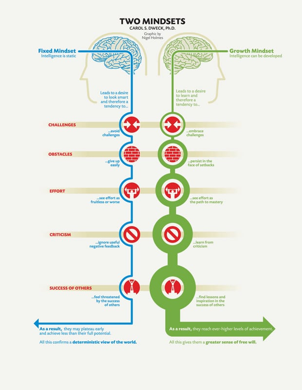

###popping my blogging cherry

Almost definitely a cliché? Or is it a right of passage every newly budding programmer has had to type? A first step into the world of programming and now blogging.
I recently joined the newest cohort at Flatiron School in London. Where, in hindsight, I was not fully prepared for the challenges ahead of me when I walked through the door on day 1 a couple of weeks ago. So I want to share a couple of things I believe to be important when starting out in the world of programming.
On a side note, I seemed to have forgotten how exhausting learning is! Concentrating all day really takes it out of you. Or that just me?

<iframe src="https://giphy.com/embed/LTYT5GTIiAMBa" width="480" height="317" frameBorder="0" class="giphy-embed" allowFullScreen></iframe>
<a href="https://giphy.com/gifs/bored-sleepy-boring-LTYT5GTIiAMBa">via GIPHY</a>

During the first week, the concept of “Imposter Syndrome” is almost drummed into you - the feeling that you might not belong, you have no idea what you are doing and at any moment someone will work this out; that you’re a fraud.
My background is the dog eat dog world of finance, where the opposite is expected, - “If you can’t spot the fool at the table, it’s you.” Everyone is out for number 1 at the end of the day. This new world of programming is completely different, it’s a team sport not an individual one. Everyone is offering help at every turn and we’re all on the same team! (It’s like being in Canada, compared to the London tube.)
“Imposter Syndrome” has been all about adopting the correct mindset, and accepting that its alright to admit you don’t have the answer or you’re not sure and that’s ok. Previously, that wasn’t really an option, it was seen as weakness to ask for assistance as you’re being judged on your output, which in turn, equated to your value.

Choosing to see criticism and failures as challenges and opportunities to learn will only help progress. As well as seeing success in others as opportunities to learn rather than signs of your own failure.
This all being said, it’s tough to maintain optimism. There are plenty of moments we’ve all felt like Moss, I’m sure.

<iframe src="https://giphy.com/embed/lNubxCPAPvSUw" width="480" height="277" frameBorder="0" class="giphy-embed" allowFullScreen></iframe>
<a href="https://giphy.com/gifs/frustration-lNubxCPAPvSUw">via GIPHY</a>

I’ve learnt to celebrate the little wins, because you quickly realise it’s just one little piece of the puzzle that is learning to code. We are all learning at different paces; topics that you find hard to grasp quickly, others pick up easily and vice versa. So don’t be too critical on yourself.

<iframe src="https://giphy.com/embed/cAlo9biOeDAkM" width="480" height="269" frameBorder="0" class="giphy-embed" allowFullScreen></iframe>
<a href="https://giphy.com/gifs/somebody-months-shift-cAlo9biOeDAkM">via GIPHY</a>

The second thing, which took me longer than it should have done, is TDD or Test Driven Development. I had too much reliance on the inbuilt test suites, as the ability to just type learn into terminal was very convenient at first.
But, at some point you have to take the training wheels off….

A shoutout to pry. This little hero allows to jump into your code and see what works and what doesn’t.
All in takes is you to use “require ‘pry’” and “binding.pry” and you can now test your methods, variables and whatever else within the pry console.

My reliance on using the provided learn and rspec tests slowed progress and my increased my reluctance to test my methods whenever there wasn’t a test suite available to do so. Unfortunately, this is not how the real world operates and typing code at 100 miles an hour untested, with my current abilities is completely useless.
As it’s best not to follow the kid in the gif above, take a breath and use pry, enabling you to test each line of code you write. Debugging is an essential skill for programming, full stop. Even more so, when you’re starting out. Allowing smooth, cruising into Mod 2. Just remember to exit pry when you’re done!!!