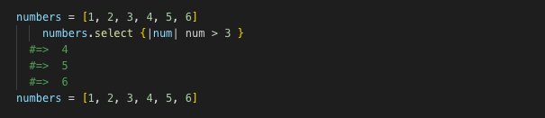
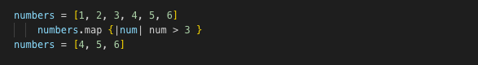

###with the world's greatest secret agent

<iframe src="https://giphy.com/embed/tsGQgvmce0v4I" width="480" height="392" frameBorder="0" class="giphy-embed" allowFullScreen></iframe>
<a href="https://giphy.com/gifs/aisha-tyler-sterling-archer-lana-kane-tsGQgvmce0v4I">via GIPHY</a>

It seems so simple when you know how, but when starting out, many (myself included) have struggled to know which iterator to use when faced with having to iterate through an array (or hash — for the ease of my examples will be using arrays).
In order to iterate through an array, we have to take in a block. A block is defined by a variable enclosed by pipes “|variable|”; we can make the variable anything we want, but it’s good practice to singularise the name of the array (hoping the array, is named appropriately too). The variable is now acting as each element of the array.
To bang! or not to bang! That is the question. Here comes the inappropriateness! Do we want to use a destructive method or non-destructive one is a key question you need to ask yourself when picking the correct iterator. If you want to return the same array as which you started with (non-destructive) or to alter the returning array (destructive).

<iframe src="https://giphy.com/embed/13PR67zViZjXi" width="480" height="266" frameBorder="0" class="giphy-embed" allowFullScreen></iframe>
<a href="https://giphy.com/gifs/bench-outstanding-recognize-13PR67zViZjXi">via GIPHY</a>

We’ll start with the non-destructive iterators:
Let’s start simple, with .each. This iterator allows us to iterate through an array and run a method on each element of the array. It will output the result of our method, but leave the array in its original state.

Next up is .select, which is used when we want to pick out which elements of our array match with a certain criteria (.select usually asks a question rather than performing an action). It is also a non-destructive iterator, so while outputting a selection which matches the criteria, the array itself remains unchanged.

The opposite of .select is .reject, which dependant on the criteria will remove the elements which match the criteria from its returning values, but will also leave the array in its original state.

Similar to .select, there is .detect (also known as .find) which does the same thing as .select, but only returns the first element of the array which fits with our criteria and not all of the them.

Lets move on to the destructive iterators:

<iframe src="https://giphy.com/embed/Z3AqPdOdolOFi" width="480" height="211" frameBorder="0" class="giphy-embed" allowFullScreen></iframe>
<a href="https://giphy.com/gifs/spoilers-lana-sterling-Z3AqPdOdolOFi">via GIPHY</a>

######Are you coming?

We have .map (also known as .collect) which will return an altered array from its original with whatever function has been applied. Sidenote: if you use a comparison (“==”) with .map rather than a method, an array of Booleans are returned.

Other destructive iterators, of which work similarly to .select and .reject, are .keep_if and .delete_if which dependant on the criteria, either keep within or delete from the new returning array.

There is also .compact, which isn’t an iterator, but is a useful little method and will return a new array having removed all the nil values.

To bang! or not to bang!? We can make many non-destructive methods destructive by adding a bang! which if have studied the english language at all you probably know it as an exclamation mark! In effect, .select! is the same as .keep_if and .reject! is the same as .delete_if.
The bang! at the end of the method name, means the method will become destructive if it was previously non-destructive. The ruby language likes to have many options for each method, just look at .size, .count and .length all doing the same thing; counting the number of elements within an array. Duplicate methods make seem unnecessary to some, but Ruby is all about the ease and flow of the code; so is only happy to oblige.

<iframe src="https://giphy.com/embed/107ovk5owwWfJK" width="480" height="333" frameBorder="0" class="giphy-embed" allowFullScreen></iframe>
<a href="https://giphy.com/gifs/queue-sterling-the-rock-107ovk5owwWfJK">via GIPHY</a>

######Inappropes

Iterating through arrays, can be done a variety of ways as I have described above, and some methods are designed for more specific actions. It’s wise to take note of which method/methods do what as they will make your life easier. And after all, isn’t that what ruby is designed to do; make you happy!

<iframe src="https://giphy.com/embed/146LIs4tfXysve" width="480" height="270" frameBorder="0" class="giphy-embed" allowFullScreen></iframe>
<a href="https://giphy.com/gifs/archer-146LIs4tfXysve">via GIPHY</a>

