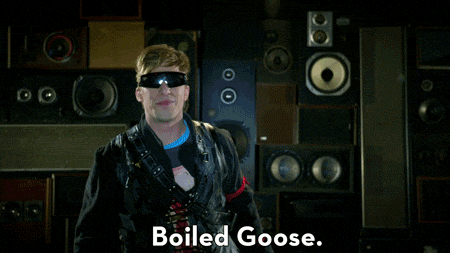

Good morning, we’ve made the jump to javascript, and coming from the happiness of ruby. Javascript sadly, doesn’t have the same loving touch; but she is a lot more exciting, (once she’s up and running).
A key difference with javascript is asynchronicity. User interfaces are asynchronous by nature, and spend most of their time waiting for user input to interrupt the event loop and trigger event handlers. This is important in JavaScript, because it is a very natural fit for user interface code, and very beneficial to performance on the server.

<iframe src="https://giphy.com/embed/3oriO7A7bt1wsEP4cw" width="480" height="336" frameBorder="0" class="giphy-embed" allowFullScreen></iframe>
<a href="https://giphy.com/gifs/newquest-coffee-hands-3oriO7A7bt1wsEP4cw">via GIPHY</a>

Browsers have to manage a lot. They’re animating a gif, they're displaying text, they're listening for clicks and scrolls and running JavaScript programs. To do all that work efficiently, browsers use an *asynchronous* execution model. That’s a fancy way of saying “they do little bits of lots of tasks until the tasks are done.”
Using a Metaphor for Synchronous Versus Asynchronous Work
A easy way to explain is through a metaphor; albeit a slightly disgusting metaphor; but it’s how I was taught and helped it stick in my memory! Let’s imagine Sam the chef in a kitchen preparing a big meal. He’s only one chef in the kitchen. Sam could prepare a boiled goose, then prepare some potatoes, then prepare some biscuits, then prepare a salad, and then serve it.

Sam’s diners would be treated to cold boiled goose, hardened potatoes, cold biscuits, and a oh so fresh salad! This is not the goal. This meal was prepared in a synchronous model: one-thing-after-the-other. The boiling of the goose “blocked” the rest of things that were waiting for work.

*Instead*, Sam the chef should move between each of these tasks quickly. Sam should use the *asynchronous* execution model browsers use. They should stuff the goose, they should measure the ingredients for the biscuits, they should peel the potatoes, etc. in a loop, *as fast as possible* so that all the tasks seem to be advancing at the same time. If Sam were to adopt this *asynchronous* model of work, the diners would be treated to piping-hot boiled goose, steaming potatoes, soft biscuits, and a fresh salad.

##Describing a Synchronous Code Bloc

>`let sum = 1 + 1; // Line 1`  
>`let list = document.querySelectorAll(“li”); // Line 2`

In this case, when we hit the definition of `sum`, this work doesn't rely on any "questionable" or "unknowably long" process. As soon as the work of Line 1 is done, JavaScript will then go to work finding elements and assigning them to `list` in Line 2.

But let’s consider a “blocking” operation. Imagine we had a synchronous function called `synchronousFetch("URL STRING")`that fetches data from the network.

>`let tooMuchData = synchronousFetch(“http://genome.example.com/...");` // Line 1  
>`let list = document.querySelectorAll(“li”);` // Line 2
>`console.log(tooMuchData);` // Line 3

That work in Line 1 could take a long time (e.g. slow network), or might fail (e.g. failed login), or might retrieve a ***huge*** amount of data (e.g. The Human Genome).

It’s possible that the `let list` in Line 2 *will never execute*! While JavaScript is executing `synchronousFetch` it will not be able to animate gifs, you won't be able to open a new tab, it will appear "locked up." Recall our Sam the chef metaphor: while Sam prepares the biscuits, the mashed potatoes grow cold and the boiled goose congeals. Gross.

<iframe src="https://giphy.com/embed/pVAMI8QYM42n6" width="480" height="360" frameBorder="0" class="giphy-embed" allowFullScreen></iframe>
<a href="https://giphy.com/gifs/january-joan-baez-googles-pVAMI8QYM42n6">via GIPHY</a>

##Describe an Asynchronous Code Bloc

Asynchronous code in JavaScript looks a lot like event handlers. And if we think about it, that makes sense. You tell JavaScript:

>Hey, do this thing. And then go do whatever maintenance you need: animate that gif, whatever. But when that first thing has an “I’m done” event, go back to it and do some work that I defined in a function when I called it.

Let’s imagine a function called `asynchronousFetch` that takes as arguments:

1. A URL String  
2. An arrow function that will have the fetched data passed into it as its first argument when the asynchronousFetch work is done

>`asynchronousFetch(“http://genome.example.com/...", tonOfGeneticData => sequenceClone(tonOfGeneticData)); // Line 1 ` 
>`let list = document.querySelectorAll(“li”); // Line 2`

In this case, JavaScript starts the `asynchronousFetch` in Line 1, and then sets `list` in Line 2. Some time later (who knows how long?), the fetch of data finishes and that data is passed into the "callback" function as `tonOfGeneticData` — back on Line 1.

Most asynchronous functions in JavaScript have this quality of “being passed a callback function.” It’s a helpful tool for spotting asynchronous code “in the wild.”

##Identifying a Synchronous Code Bloc

As we have experienced in JavaScript, our code executes top-to-bottom, left-to-right.

`function getData(){`  
`console.log(“2. Returning instantly available data.”);`  
`return [{name: “Lloyd Christmas”}, {name: “Harry Dunne”}]`  
`}`

`function main(){`  
`console.log(“1. Starting Script”);`  
`const data = getData();`  
`console.log("3. Data is currently ${JSON.stringify(data)}");`  
`console.log(“4. Script Ended”);`  
`}`  
`main();`

We can copy and paste this into a DevTools console to see the result. It matches our default model of “how code runs.”

##Identifying an Asynchronous Code Bloc

The easiest asynchronous wrapper function is `window.setTimeout()`. It takes as arguments:

- a Function (the "callback" function)
- a Number representing milliseconds

The `setTimeout()` will wait the number of milliseconds and then execute the callback.

>`setTimeout(() => console.log(‘Hello World!’), 2000);`

This says “Hello World!”… in 2 seconds. Try it out in the DevTools console!

Since this code is in an *asynchronous* container, JavaScript can do other work and *come back* when the work “on the back-burner is done.” If JavaScript *didn’t* have an asynchronous model, while you waited those 2 seconds, no gifs would animate or any background applications would run in your browser. Asynchronous execution makes browsers the exceedingly useful tools they are.

With our code written in this order:

>`setTimeout(() => console.log(‘Hello World!’), 2000)`  
>`console.log(“No, me first”)`

The delay from `setTimeout()` means the line below returns first:

>`No, me first`  
>`Hello World!`

JavaScript is so committed to trying to squeeze in work when it gets a chance that this has the exact same output!

>`setTimeout(() => console.log(‘Hello World!’), 0) // 0 Milliseconds!!`  
>`console.log(“No, me first”)`

The browser has < 0 milliseconds (i.e. nanoseconds) to see if it can find any work to do!

<iframe src="https://giphy.com/embed/3orieQoeTOzSK2ijbW" width="480" height="366" frameBorder="0" class="giphy-embed" allowFullScreen></iframe>
<a href="https://giphy.com/gifs/season-9-the-simpsons-9x1-3orieQoeTOzSK2ijbW">via GIPHY</a>

##Conclusion

JavaScript in the browser has an asynchronous execution model. This fact has little impact when you’re writing simple code, but when you start doing work that might block the browser you’ll need to leverage asynchronous functions. Remember, these functions can be surprising and nearly every JavaScript developer sooner or later forgets to reckon with asynchrony.
While working asynchronously can be a bit of a headache for developers; it allows JavaScript to do other work whenever it has opportunity. An important, useful method which runs asynchronously are `setTimeout()` and `fetch()` among others.

<iframe src="https://giphy.com/embed/Tur1zsvqIhm3S" width="480" height="289" frameBorder="0" class="giphy-embed" allowFullScreen></iframe>
<a href="https://giphy.com/gifs/movie-film-reaction-Tur1zsvqIhm3S">via GIPHY</a>
