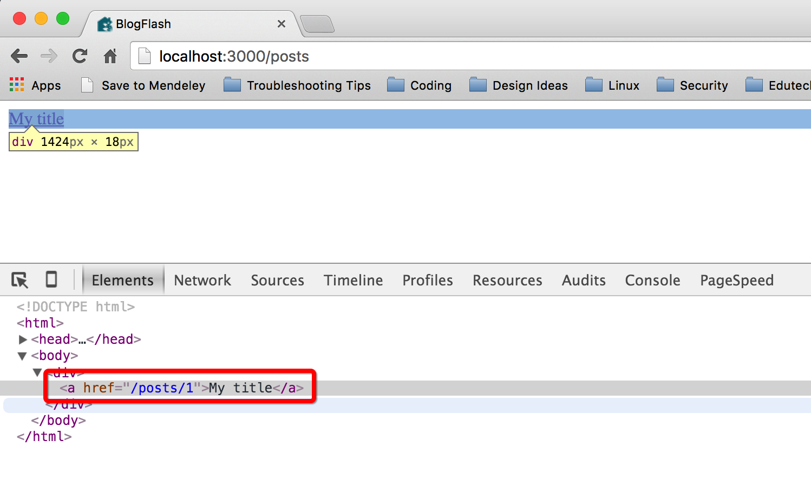

###a helpful guide to how rails paths work

Rails is designed to be flexible; the result is that is usually a few ways to get the job done. Routes are a great example of this principle in a Rails app. I will review how to leverage built-in URL help methods instead of hard coding route paths in your app.

<iframe src="https://giphy.com/embed/toSAzWmcwofew" width="278" height="480" frameBorder="0" class="giphy-embed" allowFullScreen></iframe>
<a href="https://giphy.com/gifs/bang-head-toSAzWmcwofew">via GIPHY</a>

##Paths vs Route Helpers
What’s a real world difference between using hard coded paths compared with route helper methods? Let’s imagine that you have a meeting in London, and you want to get from one side of the city to the other. You have a couple different options:

1. Traverse the streets on foot
2. Take an black cab/uber

Walking is like hard coding your route’s path. Sure, it can work. However, it’s a slow, time consuming and easy to get wrong, and, if the meeting location changes, it will require quite a bit of manual work to adjust and get to the new destination.
Taking a cab/uber is like using a route helper: you can simply provide the address to the driver and let them navigate the city streets for you. It is faster than walking, and, if the address for the meeting changes while you’re en route, it’s not as difficult or slow to adjust.

- **Hard coded path:** `/posts/#{@post.id}`

- **Route helper:** `post\_path(@post)`

So why would we want to use route helper methods as opposed to hard coding paths into the application? Below are a few of the key rationales:

- Route helpers are more dynamic since they are methods and not simply strings. This means that if something changes with the route there are many cases where the code itself won’t need to be changed at all.

- Route helper methods help clean up the view and controller code and assist with readability. *On a side note, you cannot use these helper methods in your model files.*

- It’s more natural to be able to pass arguments into a method as opposed to using string interpolation. For example, `post\_path(post, opt\_in: true)` is more readable than `posts/<%= post.id %>?opt\_in=true`.

- Route helpers translate directly into HTML-friendly paths. In other words, if you have any weird characters in your urls, the route helpers will convert them so they can be read properly by browsers. This includes items such as spaces or characters such as `&`, `%`, etc.

<iframe src="https://giphy.com/embed/lyZUv9HTgkfx6" width="480" height="270" frameBorder="0" class="giphy-embed" allowFullScreen></iframe>
<a href="https://giphy.com/gifs/rail-lyZUv9HTgkfx6">via GIPHY</a>

##Implementing Route Helpers

To begin, I’m going to start with an application that has the MVC set up for `posts`, with `index` and `show` actions currently in place. Within the `config/routes.rb` file it would look like this:

- resources :posts, only: [:index, :show]

If we ran `rails routes` in the terminal it will give the following output:

- posts GET /posts(.:format) posts#index
- post GET /posts/:id(.:format) posts#show

These four columns tell us everything that we’ll need in order to use the route helper methods. The breakdown is below:

- **Column 1** — This column gives the prefix for the route helper methods. In the current application, `posts` and `post` are the prefixes for the methods that you can use throughout your applications. The two most popular method types are `\_path` and `\_url`. So if we want to render a relative link path to our posts' index page, the method would be `posts\_path` or `posts\_url`. The difference between `\_path` and `\_url` is that `\_path` gives the relative path and `\_url` renders the full URL.

**In general, it's best to use the `\_path` version so that nothing breaks if your server domain changes.**

- **Column 2** — This is the HTTP verb.

- **Column 3** — This column shows what the path for the route will be and what parameters need to be passed to the route. As you may notice, the second row for the show route calls for an ID. When you pass the `resources` method to the `:show` argument, it will automatically create this route and assume that you will need to pass the `id` into the URL string. Whenever you have `id` parameters listed in the path like this, you will need to pass the route helper method an ID, so an example of what our show route code would look like is `post\_path(@post)`. Notice how this is different than the `index` route of `posts\_path`. We can ignore the `(.:format)` text for now.

- **Column 4** — This column shows the controller and action with a syntax of `controller#action`.

Route helper methods become nice and predictable. If a Rails application was built with traditional routing conventions, you will see the CRUD controllers for newsletters, students, sales and coupons, you don't have to look up the routes to know that you could call the index URLs for each resource below:

- Newsletters — `newsletters\_path`
- Students — `students\_path`
- Sales — `sales\_path`
- Coupons — `coupons\_path`

##link\_to Method

Rails is smart enough to know that if you pass in the `post` object as an argument, it will automatically use the ID attribute, so our code linking thee index view to the show view could look like this:

>`<% @posts.each do |post| %>`  
>`<%= link\_to post.title, post\_path(post) %>`  
>`<% end %>`

<iframe src="https://giphy.com/embed/e7eZRpz4JDkqc" width="480" height="278" frameBorder="0" class="giphy-embed" allowFullScreen></iframe>
<a href="https://giphy.com/gifs/rails-e7eZRpz4JDkqc">via GIPHY</a>

We’re using the `link\_to` method to automatically create an HTML `a` tag. If you open the browser and inspect the HTML element of the link, you would see the following:

As you can see, even though we never added HTML code for the link — e.g., `` –– the `link\_to` method rendered the correct tag for us.

##Using the :as option

If for any reason you don’t like the naming structure for the methods or paths, you can customise each route easily. A common change is updating the path users go to in order to register for a site. Out of the box, the standard path would be `/users/new`. However, we would want something a little more readable, like `/register`. We could update `ourconfig/routes.rb` file with:

>`get '/register', to: ‘users#new', as: ‘register'`

Now the application lets users navigate to `/register` to sign up, and you, the developer, can utilise your own custom `register\_path` route helper throughout the app.

<iframe src="https://giphy.com/embed/otXUdOJgy623e" width="480" height="348" frameBorder="0" class="giphy-embed" allowFullScreen></iframe>
<a href="https://giphy.com/gifs/quote-quotes-train-otXUdOJgy623e">via GIPHY</a>

